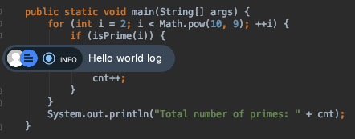
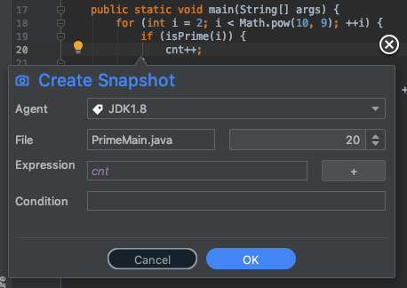

# Lightrun actions

Actions are any of the snapshots, logs or metrics that you add to your applications directly from specific lines of code. 

From the IDE, you can:

- [add the Lightrun action](#addaction) you need directly inline from your code

- [configure logs](#configure-logs)

- [create snapshots (breakpoints)](#_snapshot_breakpoint)

- [configure metrics](#configure-metrics)

!!! note
     A system quota controls use of CPU, Networking, Memory, excessively long strings, too many instructions printing out, protection from infinite loops and the like 

###### Prerequisites

--8<-- "ux-reference/plugin-intellij-prereq.md"

###### To add a Lightrun action {#addaction}

1. Go to the line in your code that you need to debug. 

2. Right-click to open the IntelliJ context menu: 

  

3. Hover over the Lightrun option at the top of the menu to open the sub-menu: 

  

5. Now, choose your action: 

  - [configure logs](#configure-logs)

  - [create snapshots (breakpoints)](#_snapshot_breakpoint)

  - [configure metrics](#configure-metrics)

## Logs {#configure-logs}

You can add logs directly to your application while it's running. 

###### To add a log

1. Go to the line of your source code at which you'd like to insert the log. 

2. Right-click to open the IntelliJ context menu: 

  

3. Open the Lightrun context menu: 

  

4. Select **Log** from the Lightrun context menu.

    The **Create Log** dialog opens: 
	
	

5. Complete the fields in the dialog as follows:

  -   **Agent**
      
      --8<-- "ux-reference/pick-agent.md"

  -   **File**
      
      --8<-- "ux-reference/file.md"

  -   **Format** - the actual log string; use expressions such as `My variable is {var}` including even method invocations such as: `Method value: {myMethod() + 5}`

  -   **Log Level** - Debug, Info, Warning or Error; once configured, logs can also [be filtered](plugin.md) by this attribute

  -   **Condition**
      
      --8<-- "ux-reference/configure-condition.md"

  
6. Click **Advanced** to configure the following additional fields:
  
  - **Ignore quotas** 
  
    --8<-- "ux-reference/ignore-quotas.md"

  - **Expiry**
  
    --8<-- "ux-reference/expiry.md"

 
7. Click **OK** to add the log. A marker is also added to the area above the line:

    

  !!! tip
      Customize your profile picture as it appeers in the marker at [gravatar.com](https://en.gravatar.com/)

8. Click  from the log marker to delete or edit the log configuration. 

    

## Snapshots {#_snapshot_breakpoint}

A snapshot is a one-time "breakpoint" that doesn't block your code from running; as opposed to a traditional breakpoint, snapshots collect the stack trace and variables without interrupting the application at all.

###### To add a snapshot

1. Go to the line of your source code at which you'd like to insert the snapshot. 

2. Right-click to open the context menu:  

  

4. Select **Snapshot**:

    The **Create Snapshot** dialog opens: 
	
	

2. Complete the fields in the dialog as follows:

  -   **Agent**
      
      --8<-- "ux-reference/pick-agent.md"

  -   **File**
      
      --8<-- "ux-reference/file.md"

  -   **Expression**
      
      --8<-- "ux-reference/expression.md"

  -   **Condition**
      
      --8<-- "ux-reference/configure-condition.md"

  

3. Click **Advanced** to configure the following additional fields:

  - **Max Hit Count**
  
    the maximum number of times the snapshot should be taken during the lifetime of the action; default == 1.
  
  - **Ignore quotas** 
  
    --8<-- "ux-reference/ignore-quotas.md"

  - **Expiry**
  
    --8<-- "ux-reference/expiry.md"

 

4. Click **OK** to add the log. A marker is also added to the area above the line:

    The snapshot is added and displayed in the bottom sidebar, and an icon is added to the margins of the code on the line where it was added.

    The Snapshot view is further detailed [here](LightrunConsole.md)

5.  Click  from the log marker to delete or edit the log configuration.   

## Metrics {#configure-metrics}

You can add the following metrics to be tracked per line in your code: 

- [Counters and time measures](#_counter) - count the number of times a specific line of code throws an exception

- [Measure Duration](#duration)

- [Custom Metrics](#custom)

### Counters and time measures {#_counter}

The counter action counts every time the given line was reached and periodically logs that information to the standard logger.

Similarly, you can add a time duration metric to measure the amount of time the specified code block runs, and then use this data to help investigate issues, track performance trouble or compare to other lines of code.

###### To add a counter

1. Go to the line of your source code at which you'd like to insert the snapshot. 

2. Right-click to open the context menu:  

  

3. Hover over [**Metrics**](#addaction) and then click **Counter** or **Time Measure (tictoc)** from its sub-menu.

    The **Create Counter** appears as follows: 
	
	
	
	The **Create Time Duration (tictoc)** appears as follows: 
	
	

4. Complete the fields in the dialog as follows:

  -   **Agent**
      
      --8<-- "ux-reference/pick-agent.md"

  -   **File**
      
      --8<-- "ux-reference/file.md"

  -   **Name**
      
      --8<-- "ux-reference/unique-name.md"

  -   **Condition**
      
      --8<-- "ux-reference/configure-condition.md"

  
5. Click **Advanced** to configure the following additional fields:

  - **Aggregate By (Counters only)** - collect and aggregate data only for the referenced string
  
  - **Ignore quotas** 
  
    --8<-- "ux-reference/ignore-quotas.md"

  - **Expiry**
  
    --8<-- "ux-reference/expiry.md"

 
6. Click **OK** to add the metric. A marker is also added to the margins of the code on the line where it was inserted.

7. Click  to delete or edit the counter configuration. Click  to delete or edit the time measure metric configuration.

[//]: # ### Set value {#_set_value} 
[//]: # 
[//]: # One trick in debugging is to set a variable to a different value and force a specific code path. This can be particularly useful when patching broken behavior. 
[//]: # 
[//]: # !!! example
[//]: #      If a feature fails and it's surrounded by an `if` statement, you might be able to disable that feature by forcing the value of a variable.
[//]: # 
[//]: # !!! warning
[//]: #      This is an extremely risky action, and as such only users with the set-value role can execute it. 
[//]: # 
[//]: # ###### To add a set value action
[//]: # 
[//]: # 1. Go to the line of your source code at which you'd like to set a value. 
[//]: # 
[//]: # 2. Right-click to open the context menu:  
[//]: # 
[//]: #   
[//]: # 
[//]: # 3. Hover over [**Metrics**](#addaction) and then click **Set Value**.
[//]: # 
[//]: # 
[//]: # 4. Enter the relevant variable name for the left-side argument. Please notice that the left hand side must be a variable in context and can't be a method.
[//]: # 
[//]: # 5. In the right-side field, enter the assigned value. Valid values include any Java expression, including a method invocation. 
[//]: # 
[//]: # 6. You can use the `+` button to add additional assignments
[//]: # 
[//]: # 7. Click **Ok** to set the action.
[//]: # 
[//]: # 
[//]: # !!! important
[//]: # 
[//]: #      Quotas aren't imposed on set-value operations and as such the performance impact can be significant. 
	 
	 
### Measure duration {#duration}

1. Go to the line of your source code for which you'd like to measure duration. 

2. Right-click to open the context menu:  

  

3. Hover over [**Metrics**](#addaction) and then click **Method Duration**.

    The **Create Measure Duration** dialog opens: 
	
	

4. Complete the fields in the dialog as follows:

  -   **Agent**
      
      --8<-- "ux-reference/pick-agent.md"

  -   Method - 

  -   **Name**
      
      --8<-- "ux-reference/unique-name.md"

  -   **Condition**
      
      --8<-- "ux-reference/configure-condition.md"

  
5. Click **Advanced** to configure the following additional fields:

  - **Ignore quotas** 
  
    --8<-- "ux-reference/ignore-quotas.md"

  - **Expiry**
  
    --8<-- "ux-reference/expiry.md"

 

6. Click **OK** to add the metric. An icon is added to the margins of the code on the line where it was added.

7. Click  from the log marker to delete or edit the log configuration.

### Custom metrics {#custom}

You can insert your own customized metrics using regular expressions.

###### To insert a custom metric

1. Go to the line of your source code at which you'd like to insert custom metrics. 

2. Right-click to open the context menu:  

  

3. Hover over [**Metrics**](#addaction) and then click **Custom Metric**.

    The **Create Custom Metric** dialog opens: 
	
	

4. Complete the fields in the dialog as follows:

  -   **Agent**
      
      --8<-- "ux-reference/pick-agent.md"

  -   **File**
      
      --8<-- "ux-reference/file.md"
	
  

  -   **Name**
      
      --8<-- "ux-reference/unique-name.md"

  -   **Expression**
      
      --8<-- "ux-reference/expression.md"

  -   **Condition**
      
      --8<-- "ux-reference/configure-condition.md"

  

5. Click **Advanced** to configure the following additional fields:

  - **Ignore quotas** 
  
    --8<-- "ux-reference/ignore-quotas.md"

  - **Expiry**
  
    --8<-- "ux-reference/expiry.md"

 

6. Click **OK** to add the log. An icon is added to the margins of the code on the line where it was added.

7. Click  to delete or edit the counter configuration.

## Edit and delete actions

Once you create an action, the relevant icon appears in the gutter of your code, similar to the following: 

1. Hover over the relevant icon to read its tooltip. 

2. Right-click the icon for other relevant options.

3. To view notifications, errors, etc., select **Info** to learn more.

4. To update or change the action, click **Edit**. 

5. To remove the action, click **Delete**.

