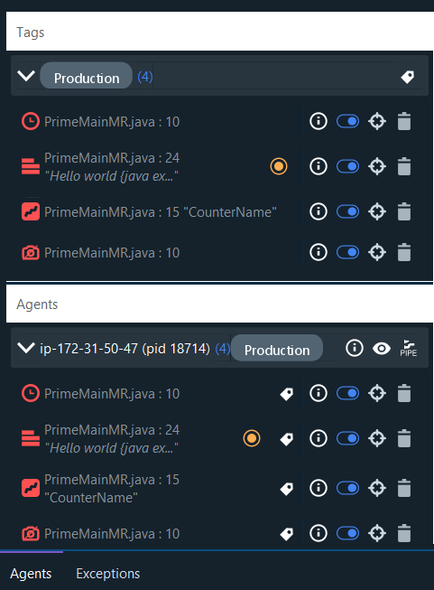
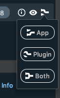

# Data views in the IDE

The Console and Snapshot views enable you to view log, metric and snapshot data in real time directly from the IDE, depending on what [you've added](LightrunActions.md).

--8<-- "ux-reference/plugin-intellij-prereq.md"

From the IDE, you can: 

- [configure log piping](#piping) to view data directly from the IDE
- [view logs and metrics](#view)
- [view the stacktrace](#snapshot) based on the snapshots you added 

#### To configure piping {#piping}

1. Navigate to the Lightrun right-hand sidebar:

    

2. From the relevant agent, click  to open the **Piping** menu: 

    

3. Set the **Plugin** or the **Both** option to view logs from the IDE. 

    There are three levels of log piping:

    -   App -  the logs appear only in the Java application as they do by default. They just go to the standard logger.

    -   Plugin -  that logs won't show in the app. Instead they will display within the `Lightrun Console` below.

    -   Both -  that logs wll appear both in the app and in the plugin.

!!! note
    In order to pipe the logs they need to go from the agent to the Management server and to the plugin. This process is batched so logs appear in batches and with some delay

## View logs and metrics {#view}

Lightrun logs and metrics are normally printed into the standard logging framework. This is quite valuable as logs can be seen in the context of pre-existing log statements, which might provide further clues towards solving issues.

At the same time, a developer might want to see the log output and search and filter directly from the IDE as they work. To do this, first configure log piping per-agent. Once configured, all relevant information from any Lightrun actions that are added to the agents appears in the developers' consoles. 

#### To view log data from IntelliJ

Once you [configure piping for the plugin](#piping) and [add at least one log to the code](LightrunActions.md), logs and metrics start updating in real time in the Lightrun Console at the bottom sidebar in IntelliJ: 

1. Use the filters at the top right of the Console data to filter for the logs relevant to your investigation. 

2. Use the search bar at the top left to start typing and search dynamically for logs by name.

3. To free memory or remove items already viewed, click **Clear** to remove logs that have already been displayed. 

## View snapshot data {#snapshot}

Every time you add a snapshot to the code, it appears in the bottom sidebar of IntelliJ in the **Lightrun Snapshots** tab. The layout of the data that prints out is similar to the debugger interface, designed to be familiar to you. 

--8<-- "ux-reference/snapshot-stacktrace.md"

