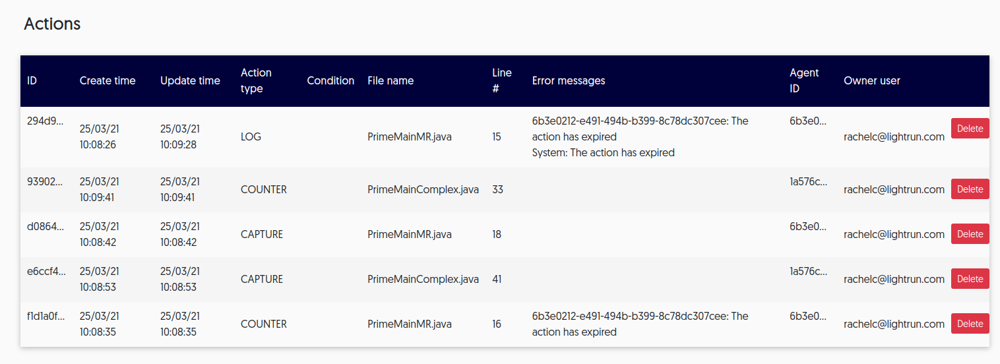

# Manage team actions

Every time any user adds an action from their plugin or from the CLI, that action is stored and can be viewed from the app.

Users with the Manager role can view and manage all actions from this view. 

## Managing actions

You can view action details and delete actions as well. 

1. Login to your Lightrun account and navigate to **Entities->Actions**.

     The **Actions** screen loads and appears similar to the following: 
	
	 
	
	 The following details can be viewed: 

     | Column         | Description                                                  |
     | -------------- | ------------------------------------------------------------ |
     | ID             | The unique ID assigned to this action by the system.         |
     | Create time    | The timestamp for when the action was added to the code.     |
     | Update time    | The timestamp for the last time changes were made to this action. |
     | Action type    | The type of action. Can be: CAPTURE (snapshot), TICTOC, LOG, COUNTER, SET_VALUE, CUSTOM_METRIC |
     | Condition      | The condition configured for this action.                    |
     | File name      | The name of the file where this action was inserted.         |
     | Line #         | The line number in the file where this action was inserted.  |
     | Error messages | All error messages on the action whenever there is an error preventing the action from running or from running correctly. |
     | Agent ID       | The ID of the agent or the name of the tag to which the action is attached. |
     | Owner user     | The name of the user who added and manages this action.      |

2. To delete the action, click **Delete** from the end of the row for the relevant action.