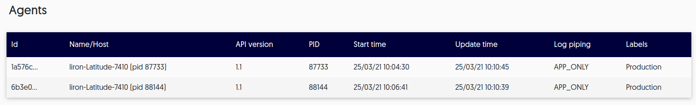

# Manage agents

Users with the Manager role can administer agents as follows: 

- [Configure agent properties](#agent-properties)

- [View active agents and their details](#view-active-agents)

## Agent properties

You can configure the agent in order to calibrate its behavior by setting the properties in the agent.config file (per agent).

The configuration file is located at the following path:

`<install_dir>/agent/agent.config`

You can set these properties from the:

- [agent.config file](#agentconfig-file)

- [Configure properties from the terminal](#cli)

### Agent.config file

To manually set the properties, navigate to the config file on the relevant server: 

`<install_dir>/agent/agent.config`

The following table describes the properties that you can customize:

| Parameter name                       | Explanation                                                  |
| ------------------------------------ | ------------------------------------------------------------ |
| `max_dynamic_log_rate`               | Number of log prints per second                              |
| `max_dynamic_log_bytes_rate`         | Number of bytes per second (on                               |
| `log_stats_time_micros`              | How often to log debugger                                    |
| `max_condition_cost`                 | Maximum cost in percentage of CPU                            |
| `max_log_cpu_cost`                   | Maximum cost of dynamic logging                              |
| `max_snapshot_buffer_size`           | The total size in bytes we allow                             |
| `max_snapshot_frame_count`           | Max frame count we allow to                                  |
| `breakpoint_expiration_sec`          | Breakpoint \\ Dynamic log                                    |
| `dynamic_log_quota_recovery_ms`      | Time to pause dynamic log after                              |
| `no_check_certificate`               | Disable certificate pinning when                             |
| `ignore_quota`                       | Disable all performance safe                                 |
| `exceptions_monitoring_enabled`      | Enable the capturing of the                                  |
| `exceptions_monitoring_stdout`       | Print all of the captured                                    |
| `exceptions_report_percentage`       | Process and report only this percentage of the exceptions thrown by the debuggee (A float between 0 and 1.0). |
| `exceptions_should_report_caught`    | Report exceptions that were caught by the application as well as exceptions that remained uncaught |
| `exceptions_max_buffer_size`         | The total size in bytes we allow to evaluate when capturing an exception (Same as snapshot) |
| `exceptions_stack_trace_frame_count` | Max frame count we allow to collect data from when capturing an excpetion (Same as snapshot) |
| `exit_after_report_all`                | Agent empties queues before the application exits. |
| `enable_pii_redaction`               | Enable personally identifiable information (PII) redaction in the agent's side (may have an effect on the application's performance) |

## Command line arguments {#cli}

--8<-- "docs/cli-manage-agentconfig.md"

## View active agents 

Whenever an agent is running, you can view its details directly from the browser. 

Log in to your Lightrun account and navigate to **Entities->Agents**.

The **Agents** screen loads, and appears similar to the following: 

The following table describes the data: 

| Column     | Description                                               |
| ---------- | --------------------------------------------------------- |
| Id         | The unique agent ID                                       |
| Host       | The host name of the server on which the agent is running |
| ApiVersion | The Lightrun API version currently implemented            |
| Pid        | The unique process identifier                             |
| StartTime  | The time at which the agent was started                   |
| UpdateTime | The last time the agent fetched actions from the server   |
| PipeLogs   | The current configuration for log piping                  |
| Labels     | Tags attached to this agent                               |

