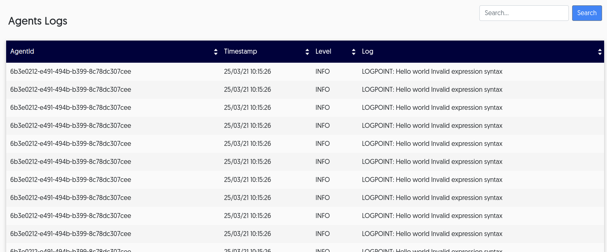

#Dynamic agent logs


As your team works with Lightrun, they can dynamically insert logs to track information based on a variety of conditions. 

Once a log is inserted into the application, it is printed with the help of the `java.util.logging` logger. By printing into the standard logging framework, you can view the logs in the context of pre-existing log statements, which might provide further clues towards solving issues.

At the same time, a developer might want to see the log output and search and filter directly from the IDE as they work, while other users might want to see the list of logs from the app in table format. 

Users can control [the piping](LightrunConsole.md#piping) of the output from the plugin. 

Depending on configuration, all relevant information from any Lightrun actions that are added to the agents appears in the developers' consoles, in the app or in both. 


## Dynamic log data

!!! prerequisites
     To view logs from the app, first ensure you've [configured piping](LightrunConsole.md#piping) from the plugin. Only data that has been configured to pipe to the app or to the app and the IDE appears in the app, meaning that if developers add actions with plugin piping only, that data does not appear here.

1. You can customize log prints by adding the following to the command line:

     ```
     -Djava.util.logging.config.file=/path/to/app.properties
     ```

  !!! note
      For additional agent customizations, see [Agent Administration](agentadmin.md)


2. To view log data from the app, log in from the browser and navigate to **Entities->Agents Logs**.
  
  The logs screen loads, and appears similar to the following:
  
  

     The following table describes the data available in this table: 

     | Column    | Description                                                  |
     | --------- | ------------------------------------------------------------ |
     | AgentId   | The unique identifier assigned to the agent by the system    |
     | Timestamp | The time at which the log was created                        |
     | Level     | The severity level of the log; this is configured per log when inserted in the code |
     | Log       | The formatted text configured when the log is inserted and any relevant errors |


!!! note
     For more information about logs, see [Lightrun Actions](LightrunActions.md). 