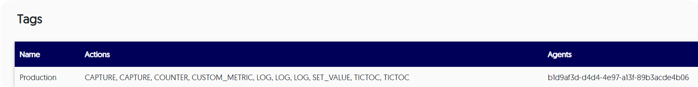

# Manage agent tags

Tagging enables you to group agents together by using a meaningful name, typically based on common functionality. For example, you can use tags to identify locations and purposes of each agent: Database Servers, Staging, and so forth. Additionally, you can apply multiple tags in any combination to each agent. 

By applying multiple tags, you can bind actions to an agent even before the agent has been launched, and you can apply actions to servers across sections. Once an action is bound to a tag, it is implicitly added to all of the agents that have that tag. 

!!! example
    Label a tag called **Integration** and set integration tests to execute with the **Integration** tag in order to debug an integration test failure.

Out-of-the-box, agents have a single **Production** tag. Users with the Manager role can:

- [Manage tags](#managing-tags)

- [View all tags](#view)

- View tags and their details directly [from the CLI](cli.md)

## Managing tags

Managers can label and apply tags.

--8<-- "ux-reference/manager-role-only 2.md"


###### To label and apply a tag to an agent

1. From the relevant server where the agent is installed, go to the `agent.metadata.json` file and open it. 

2. Insert tag names within the **tags** object (which should be nested in the **registration** object):

    ``` {.json}
    {
        "registration": {
          "tags": [
            {
              "name": "Tag1"
            },
            {
              "name": "Tag2"
            },
            {
              "name": "Tag3"
            }
          ]
        }
    }
    ```

    For example, the following JSON applies the tags ProductionsAgents, JDK1.8 and Ubuntu16 to the relevant agent:	
	
    ``` {.json}
    {
        "registration": {
          "tags": [
            {
              "name": "Productions"
            },
            {
              "name": "Staging"
            },
            {
              "name": "Dev"
            }
          ]
        }
    }
    ```

    Alternatively, tags can be applied to the agent directly from the command line using the following script:
	

    ``` {.bash}
    java -Dlightrun.registration.tags=myTag -agentpath:/path/to/agent/lightrun_agent.so RestOfTheArgumentsHere
	
    ```


3. Save the changes and close the file. 

4. Restart the agent.
   
  !!! important
      Changes to this file aren't detected until the agent is restarted.


###### To view all tag details from the app {#view}

Log in to your Lightrun account and navigate to **Entities->Tags**.

The **Tags** screen loads and appears similar to the following:




The details displayed for tags are as follows:

| Column  | Description                                               |
| ------- | --------------------------------------------------------- |
| Name    | The name of the tag.                                      |
| Actions | The list of actions currently attached to this tag.       |
| Agents  | The list of agents to which this tag has been associated. |

