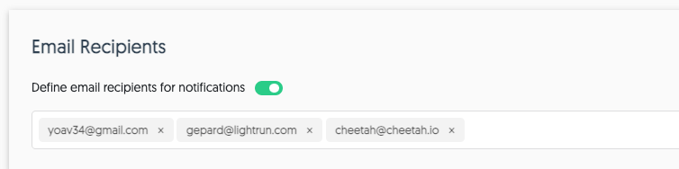

Lightrun can send you alerts to inform you about different exceptions that are thrown in your applications. 

You can configure alerts based on:

- weekly or daily notifications

- conditions:
    
  - every time there is a new error
	
  - errors that occur frequently
	
  - errors whose frequency has increased over time 

###### To configure these alerts

1. From a browser, go to your Lightrun account.

2. Navigate to **Exceptions=>Email notifications** from the menu bar.

    The **Email notifications** window opens:

    

3. To specify specific recipients for the configured notifications, enter a comma separated list of relevant addresses in the **Email Recipients** section similar to the following:

    
   
4. Enable daily and weekly notifications if relevant.  

5. Scroll down to the **Get Notifications** section:

    

    Enable the relevant options and configure their specific conditions as follows: 

  - **A new error occurs** - no special conditions
	
  - **Error occurs frequently** - the notification is to be sent once the error occurs more than the number of times indicated in the **Over** field over the course of time indicated in the **times in** field.
	
  - **Frequency of specific exception increased** - the notification is to be sent when the frequency of the error increases by X amount over the last Y amount of time.

6. Scroll to the bottom and click **Save**.