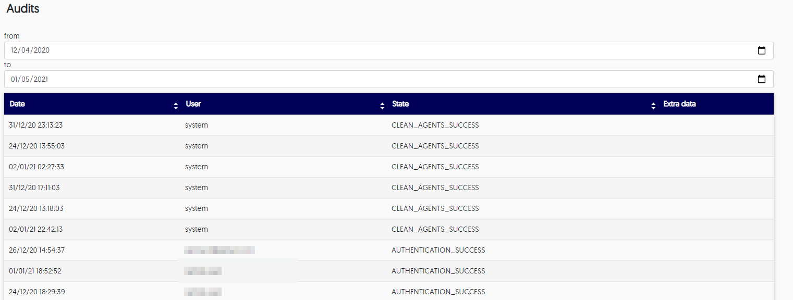

# Audit system use

Lightrun maintains an ongoing log of all use of the system, both directly from the app, and through any plugins. You can view the complete activity list, and filter by date, from the Audits area in the app. 

The audit logs display: 

- date of activity 

- user who performed the activity, including automated system actions

- the activity itself

###### To view system activity

1. Log in to your Lightrun account. 

2. Go to the Managers menu and select **Audits**. 
  
    The **Audits** list loads.
	
	
	
3. Use the **from** and **to** fields to filter by date and the arrows at the bottom to navigate by page. 

