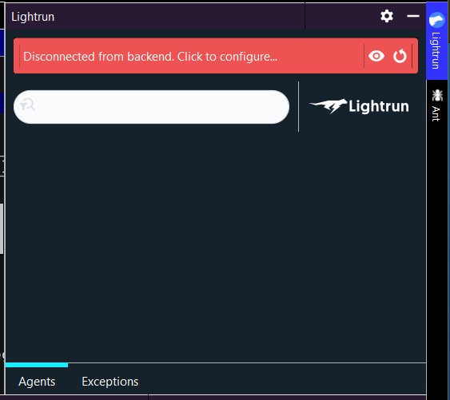
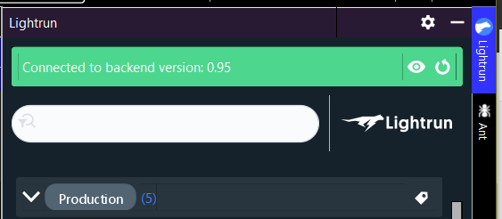
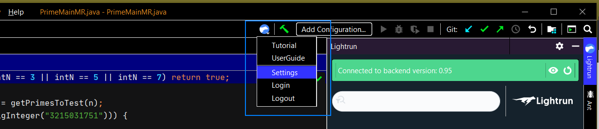

Everytime you want to work from your IDE with Lightrun, you need to first authenticate your local environment with your Lightrun account.

## Prerequisites

Before getting started, make sure:

- Your admin [installs and configures the agent and registers it](install.md) from the Application server.

- You [install the plugin in your local IntelliJ environment](install-client.md)

## Authenticate Lightrun from IntelliJ

1. From IntelliJ, click the Lightrun tab to expand the sidebar. 
   
    

2. Click the red banner from the top of the plugin display. 
	
	The browser opens to the Lightrun login page:
	
	
    
  !!! note
        The display might appear differently, with the **Login** and **Register** options appearing as buttons in the center of the Lightrun pane, similarly to the following:
        
        In this case, click the relevant option to authenticate.
	
3. Log in to Lightrun with your user credentials. 

    Once you're logged in, the Lightrun page reloads with a confirmation message. Notice that there's a timeout and you might need to re-login if it elapses.

4. Go back to IntelliJ.
    
	The Lightrun banner in IntelliJ now appears green:
    
	
	
  !!! important
      If you authenticate Lightrun successfully, but relevant options are hidden, this means no [agents are connected](install.md) on the application server. 
		
	The contextual Lightrun menu in IntelliJ displays relevant options:
    
	
	
    And the Lightrun quick menu appears on your tool bar: 
	

	

	These menus include the options to logout as well as settings and other options.
