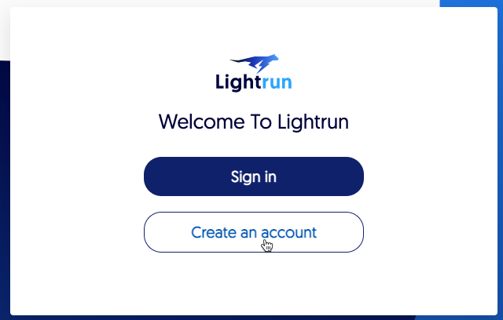
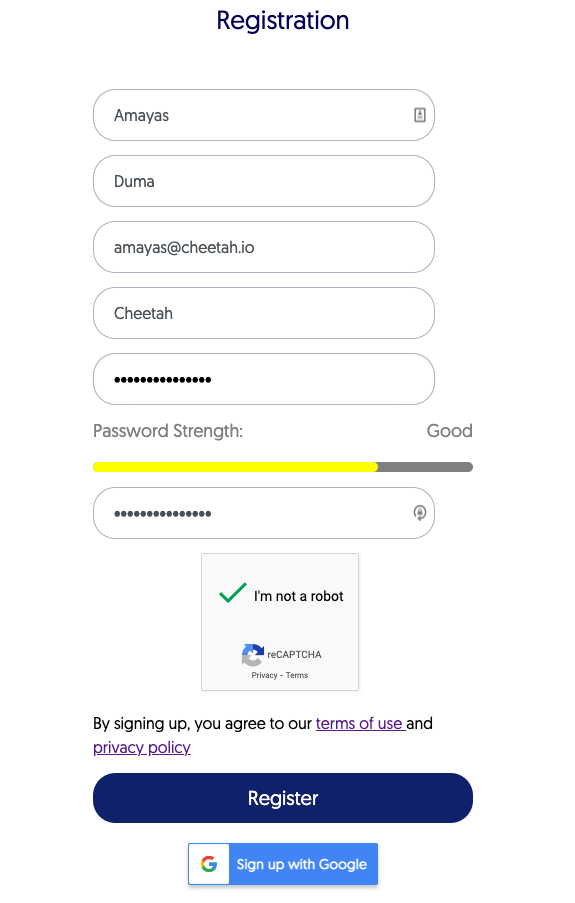
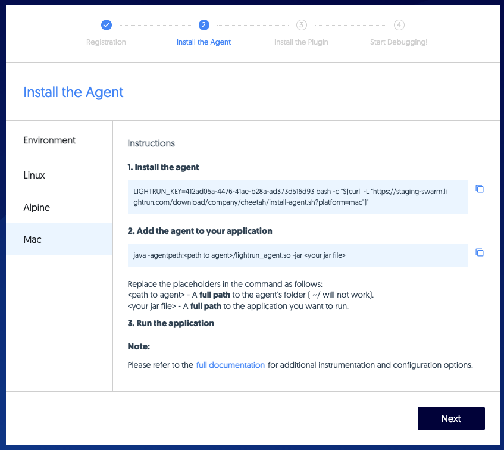
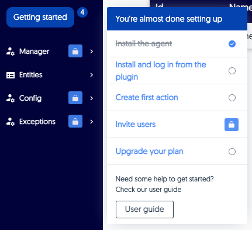

# Create your account

To get started with Lightrun, the first person in your organization must create an account for themselves and connect it to their company. 

When you do this, you are automatically assigned a Manager role. Once you access your new account, you can send invitations to others by email. 

## Sign up for Lightrun {#sign-up}

Create a user for yourself and get started setting things up by joining an existing workspace in your organization or creating a new one. 

1. From your browser, navigate to [app.lightrun.com](https://app.lightrun.com).

    The Lightrun welcome page loads.

2. To create a new account, click **Create an account**.
    
    The **Registration** page loads.
    
     

3. Complete the fields with your personal details. Choose a strong password that includes at least one lower case and upper case letter, one special character and one number. Alternatively, click **Sign up with Google** to use your Google address for quick registration.

     
    

4. Check the reCAPTCHA box and then click **Register**.

    You are redirected to our onboarding wizard. 

5. From the left panel, click the operating system of the environment in which you'll run the app for relevant agent installation instructions.
        
    Once you've installed the agent, the **Next** button appears:
    
    
    

  !!! important
      You must install the agent before proceeding to step 6. If you log out without installing the agent, when you log back in you will be redirected to the onboarding wizard again.
      
  !!! tip
      Once you've installed the agent, when you log in the next time, you're redirected to the app. If still need help with onboarding, go to the **Getting started** menu.
    
6. Click **Next**.

    Install the plugin for your IDE or click **Next** to go to the app and install the plugin later.
    
     
    

        
