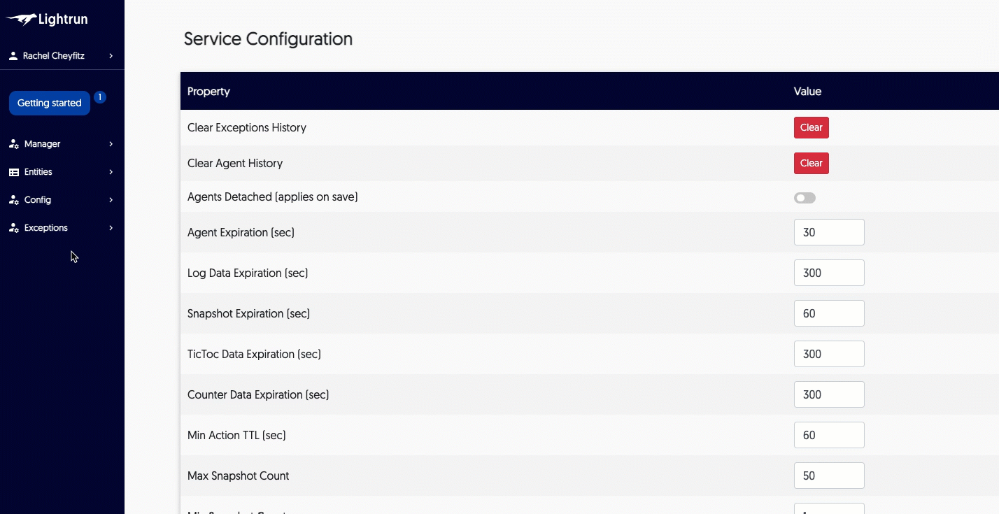

# Collect all log output

Agent logs are collected and made available for troubleshooting if any issues arise while using Lightrun. Managers can work with agent logs as follows: 

- Collect logs from all active agents 

- Download any of the collected output

- Delete log output - this only deletes the output you've collected

!!! note
    This is not related to the Lightrun log action, but rather the logs collected for running agents. 
    
###### Work with logs

1. From the browser, navigate to **Managers->Send logs by email**.

    The log collection area loads:
    
    
    
2. To collect new active logs, click **Collect**.

3. To download a log, click **Download** from the relevant log row in **Log Requests** table. 

4. To delete output, click **Delete** from the relevant log row in **Log Requests** table.