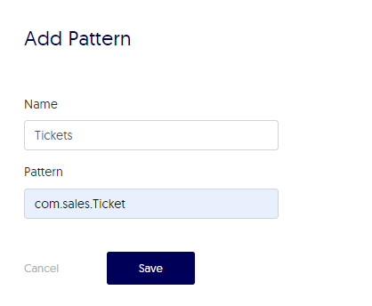
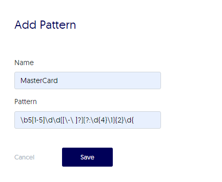

# Manage data security


You can control and protect your data by configuring: 

- Blocklisting - prevent developers from inserting breakpoints in sensitive classes

- Data redaction (PII redaction) - prevent sensitive data from appearing in logs

!!! note
    For additional security, you can [manage users and user roles](useradmin-roles.md) and [audit use of the system](audit-use.md). 


## Blocklisting

Use blocklists to prevent breakpoints from being inserted in classes that might expose sensitive data. Files and packages that are part of the patterns you've configured in the Blocklist section are protected from insertion of breakpoints. You can configure blocklisting to include a broad range of data using expressions and then thereafter, you can add exceptions for any relevant sub-classes in which you **do** want to allow breakpoint insertion in any case.

Every time the agent starts up, the configuration is downloaded and applied to all future actions. If you modify the configuration, restart the agents in order to activate the newest configuration.

All users can view the blocklists and exceptions from this area. Only managers can create, edit and delete patterns.

!!! example
    
    Prevent breakpoints for com.sales.Ticket and for all classes that aren't in com.sales with this pattern: 
	

	```com.sales.Ticket
	!com.sales```
	
	Add the following exception so that breakpoints can still be added to com.sales.Admin:
	
	`com.users.Admin`

###### To configure blocklists and exceptions 

1. Log in to your Lightrun account and go to the **Config** menu. 

2. Select **Blocklist**. 
   
	The **Blocklist** window loads with a list of any already existing patterns.  
	
3. To add a new pattern for blocklisting, click + from the **Blocklist** section.
   
	The **Add Pattern** dialog box opens: 
	
	
	
4. Enter any regular expression to indicate the pattern that should be blocklisted. 

5. Click **OK**.

    The dialog closes and the list of blocklisted patterns updates to include the newly added pattern. 
	
6. To add a blocklisting exception, click + from the **Blocklist Exception** section.
   
	The **Add Pattern** dialog box opens: 
	
	
	
7. Enter any relevant expression to indicate the pattern that should not be blocklisted. 

8. Click **OK**.

    The dialog closes and the list of blocklisted exception patterns updates to include the newly added pattern. 
	
9. Click **delete** from the relevant row to delete any pattern and enable breakpoint insertion from the Blocklist list, or to remove exceptions from the Blocklist Exception list. 

## Data redaction

Prevent Lightrun from evaluating breakpoints and logging sensitive data. 


!!! example

    Evaluate Master Card credit card data as redacted by configuring the following pattern: 
	
	`MasterCard: \b5[1-5]\d\d([\-\ ]?)(?:\d{4}\1){2}\d{4}\b`


###### To configure data redaction 

1. Log in to your Lightrun account and go to the **Config** menu. 

2. Select **PII Redaction**. 
   
	The **Data Redaction** window loads with a list of any already existing patterns.  
	
3. To add a new pattern for redaction, click +. 
   
	The **Add Pattern** dialog box opens: 
	
	
	
4. Enter any relevant regular expression to indicate the pattern that should be redacted. 

5. Click **OK**.

    The dialog closes and the list of redacted patterns updates to include the newly added pattern. 
	
6. Click **delete** from the relevant row to delete any pattern and enable breakpoints and logging analysis. 