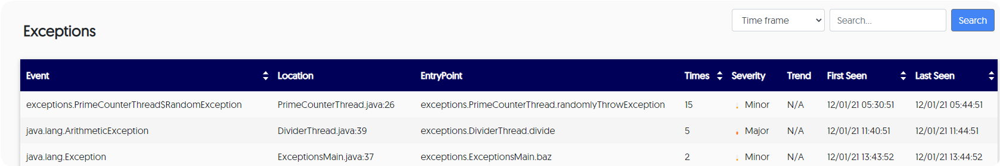

# View exceptions from the browser

Lightrun can monitor all exceptions that are thrown in the applications that you're monitoring, and then offer insights about those exceptions. 

!!! prerequisites
    
	To receive exception reports and insights, an admin should first [configure the agent for exceptions](adminexceptions-configure.md). 
	
	Additionally, by default, every exception in the application is reported - even those caught by the exception handler. You can change this with [property configuration](agentadmin-agentprops.md) in the admin.config file.

From the server you can view general statistics about exceptions, and you can also drill down to view more specific details per exception. 

###### To view exceptions data

1. From your browser, log in to Lightrun.

2. Navigate to **Exceptions → Data**

    

    The **Exceptions** table loads:

     
	
## Understanding exceptions data

--8<-- "ux-reference/exceptions-table.md"

