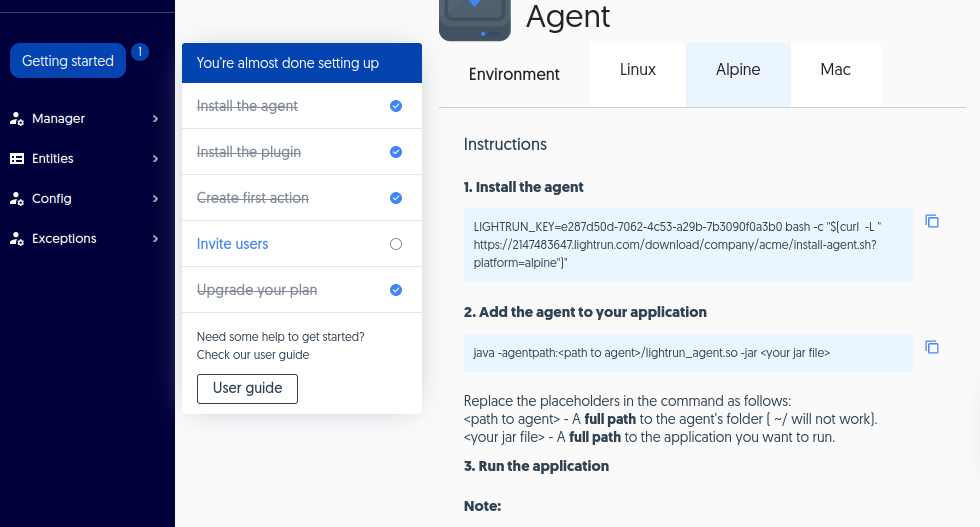

# Install the agent

--8<-- "docs/agent-theory.md"

Go to [Server Configuration](integration.md) for more details.

!!! note
    Lightrun currently supports JVM-based applications.

###### Set up the agent

1. From the server where your application is running, log in to Lightrun from the browser. 

2. Navigate to **Getting started=>Install the agent**.

    

3. From the **Install the Agent** section, select the tab for the operating system that your application server has installed. 

4. Copy and run the script. The script on this page already includes your `server IP` and `port` values.

    This script is already customized for you with your `server IP` and `port` values.   

  !!! tip
      Check out the content of the file `agent/agent.config`. It includes many options, including the URL for the Lightrun server. See [Agent Administration](agentadmin-agentprops.md) for additional information.

5. Once you've deployed the agent, add it to your application as follows:

  1. From the application server, navigate to the folder where your application resides. 

  2. From the browser, copy the command and follow the instructions to run it.

   

