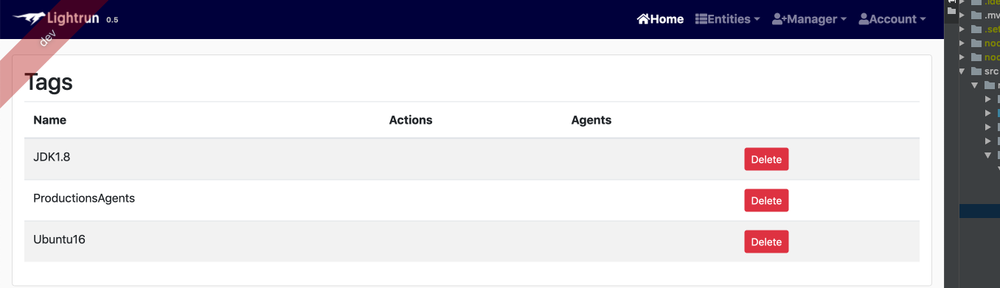

# Manage entities 

Files and packages in blacklist section that don't appear in exception section will be protected from breakpoints insertion. 

On agent startup the blacklist configuration is downloaded and applied to future actions, which means patterns modifications here require agent restart. 

All users can view the configured blacklist and exceptions. The manager can also create and delete patterns.

The entities menu includes three editable entries, tags is one such
entry. The web UI lets us delete tags that are no longer used.

