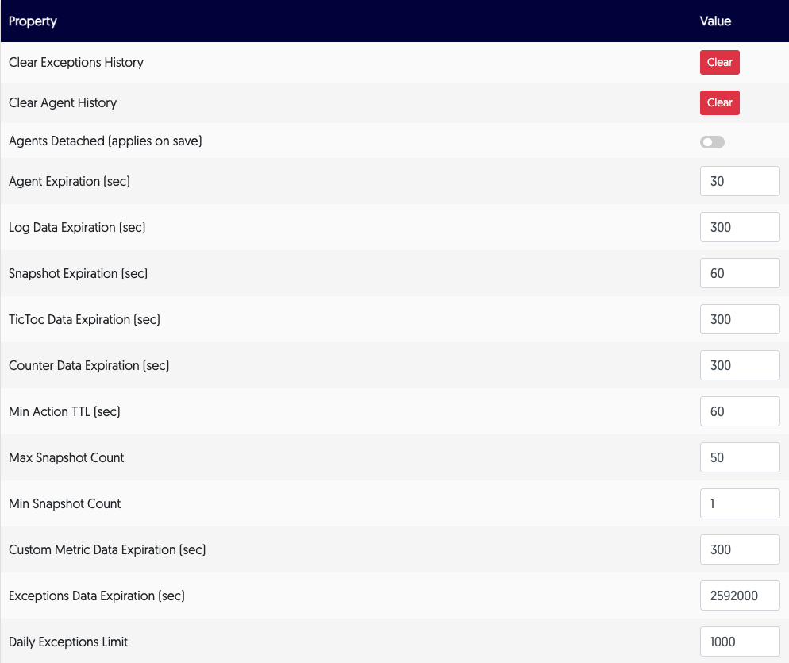

# Manage services 

You can manage certain service configurations for your developers directly from the app. 

--8<-- "ux-reference/manager-role-only 2.md"

Navigate to the **Managers** menu and select **Services**. 

The **Service Configuration** table loads: 

| Option                       | Type/unit | Default | Description |
| ----------------------------- | -------- | ----------- | ----------------------------- |
| Clear Exceptions History     | Button |    | Clears all exceptions from the cache |
| Clear Agent History | Button |  | Clears all agent activity from the cache. |
| Agents Detached (applies on save) | Toggle |  | Shuts all agents down when enabled. |
| Agent Expiration [sec]       | Seconds | 30 | This is the time it takes for the server to delete inactive agents  |
| Log Data Expiration [sec]    | Seconds | 10000 | Log data older than this is deleted |
| Snapshot Expiration [sec]    | Seconds | 60 | Snapshot data older than this is deleted |
| TicToc Data Expiration [sec] | Seconds | 300 | TicToc data older than this is deleted |
| Counter Data Expiration [sec] | Seconds | 300 | Counter data older than this is deleted |
| Min Action TTL [sec]         | Seconds | 60 | Minimum time you can set for action TTL |
| Max Snapshot Count           | Hits | 50 | Maximum hit count value you can set for snapshots |
| Min Snapshot Count | Hits | 1 | Minimum hit count value you can set for snapshots. |
| Custom Metric Data Expiration [sec] | Seconds | 300 |  |
| Exceptions Data Expiration [sec] | Seconds | 2592000 |  |
| Daily Exceptions Limit |  | 1000 |  |