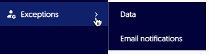
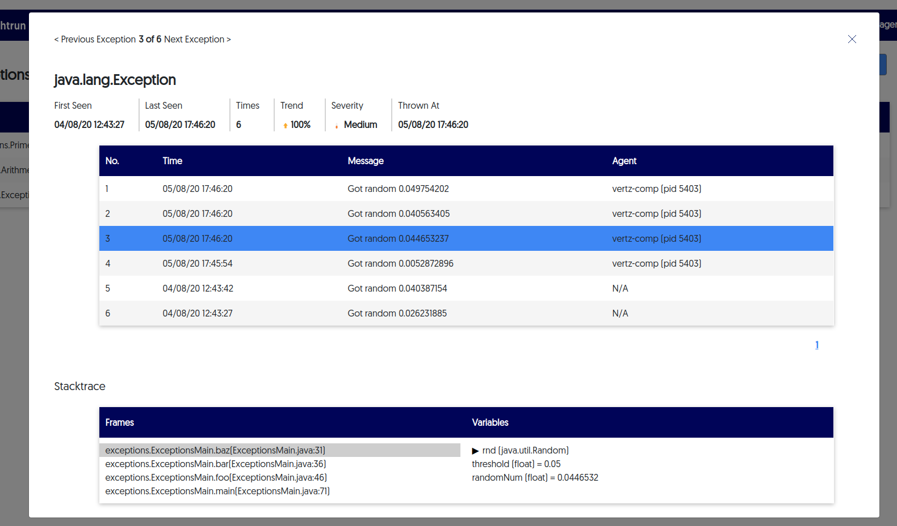

Lightrun can monitor all exceptions that are thrown in the applications that you're monitoring, and then offer insights about those exceptions. 

!!! prerequisites
    To receive exception reports and insights, first [Configure the agent for exceptions](adminexceptions-configure.md).

!!! note
    By default, every exception in the application is reported, even those caught along the way.

From the server you can view general statistics about exceptions, and you can also drill down to view more specific details per exception. 

# To view the Exceptions table:

1. Go to Exceptions → Data

In this page you'll be able to see a table with statistics on all the
exceptions thrown by all your applications.

In the top right corner of the screen there are search options. You can
search with free text and by specific time frames or by custom range.

Clicking on a specific type of exception in the table will open a modal with more details on the exception. 

Clicking on a specific exception in the table (or navigating using the \"Previous/Next Exception\" buttons above) you'll be able to see the stacktrace of each specific exception, and for each frame in the stacktrace you can see the snapshot of the frame.

