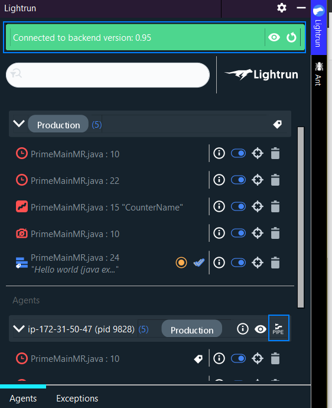

# Observability integrations overview

Lightrun offers integrations for multiple monitoring, alerting and communication platforms. The list of supported integrations is constantly expanding. You can see the updated list of the integrations and configure each of them through the **Integrations** page.

--8<-- "ux-reference/manager-role-only.md"

Currently, we support these integrations: 

- [Statsd](statsd.md)

- [Prometheus](prometheus.md)

- [Datadog](datadog.md)

- [Logz.io](logzio.md)

## Navigate to integrations

--8<-- "ux-reference/navigate-integrations.md"

## Direct data to the app  {#configure-server}

For Lightrun to send observability data to your integrations, ensure: 

- The application has a running agent attached to it

- Users have selected either App or Both for data piping from their IntelliJ instance

##### To configure piping in IntelliJ 

1. Navigate to the IntelliJ instance. 

2. Ensure Lightrun is installed and connected. 

    

3. From the **Agents** area, click  and select either **Both** or **Server** for each agent that you would like to receive data for through these integrations. 

