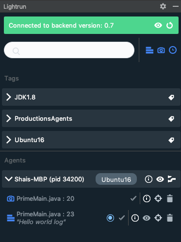
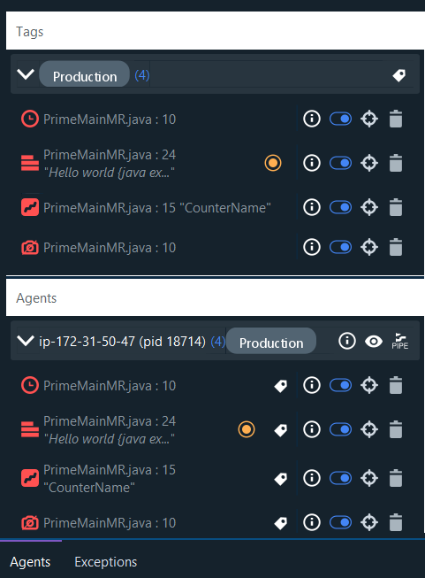
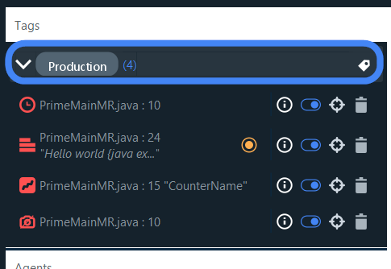
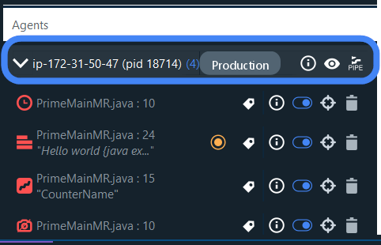
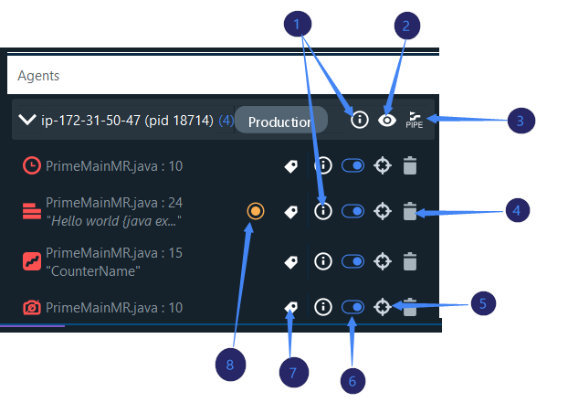
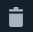
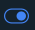
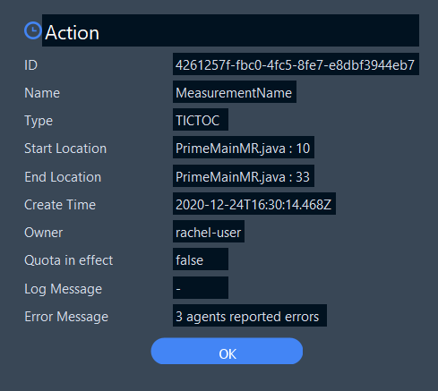
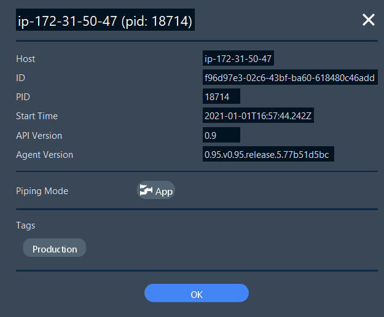

# Getting around IntelliJ with Lightrun

With Lightrun, you can add Lightrun actions (logs, metrics, snapshots) from the source code of your live app and view the relevant output both from your IDE, and from the CLI.    

--8<-- "ux-reference/plugin-intellij-prereq.md"

The rest of this article describes:

- [the layout of Lightrun in IntelliJ](#layout)

- [how to search and filter logs and metrics](#search)

- [the Agents and Tags lists and their icons](#agents)

- [the Details window](#details) for additional action and agent details 
 
                                                 
## Lightrun in IntelliJ {#layout}

Lightrun is part of the IntelliJ right-hand sidebar, and appears similarly to the following: 

 This sidebar displays all the running agents and their tags, as well as the actions that have been attached to them.

!!! note
     If these lists are completely empty or if you can only see a list of tags but not agents, the agents might all be down. Contact your manager for assistance.

This sidebar has two tabs: 

- **Agents** - lists all running agents and the logs you've attached to them from IntelliJ; this part of the sidebar is divided by [Tags](#tags) and [Agents](#agents)

    

- **Exceptions** - lists exceptions logged on running agents

Additionally, you can view logs in real time directly from the [Lightrun Console](LightrunConsole.md), located as part of the bottom sidebar. 

## Search (filter) {#search}

You can search for logs and snapshots from within specific agents with the dynamic search field. As you start typing, the list of agents updates dynamically. 

!!! tip
    This can be particularly helpful in finding specific logs when working with multiple agents.
	
## Agents and Tags list {#agents}

The **Tags** list appears similar to the following: 

The layout of the **Agents** list appears similar to the following:

Each list has a panel at the top that contains the following information: 

- An arrow to expand and collapse the list per tag or per agent.

- The name of the agent or list 

- In parenthesis, the total number of actions assigned to that tag or agent

- For Tags lists, the  icon

- For Agents lists, the icons as described below

Most of the icons are relevant for both the Agents and the Tags lists:

The following table describes the actions you can leverage from both:

|      | Icon                                                         | Component           | Description                                                  |
| ---- | ------------------------------------------------------------ | ------------------- | ------------------------------------------------------------ |
| 1    |            | [Details](#details) | Opens the information dialog box for the agent, the tag or for the action    |
| 2    |              | View/hide logs      | Toggle this button to hide/show logs in the editor. This applies to the hierarchy and can be toggled globally on the login button. |
| 3    |                  | Pipe logs           | From the Agents list only, by default Lightrun logs print into the same logger that is used by your application. Following are the three options: `App Only` (the default), `Plugin Only` and `Both`. When set to `Plugin Only` or `Both` logs added to this agent also appear in the [Lightrun console](LightrunConsole.md) of IntelliJ. |
| 4    |                   | Delete action       | Delete any agent or tag actions. Only agent-activated actions can be deleted from the Agents list and tag-activated actions from the Tags list. |
| 5    |                 | Go to line          | Jump to the source file and line number in the code that is associated with the action. |
| 6    |                   | Toggle              | Toggle to disable or enable an action. Only agent-activated actions can be toggled from the Agents list and tag-activated actions from the Tags list. |
| 7    |  | Status indicator    | Displays the current state of the action. One checks indicates the action was submitted to the server. Two checks indicate that it was received by the agent. Highlighted checks indicate that the agent accepted the action. From the Agents list, the tag icon indicates the action was activated with tags and not agents, and its status can be viewed from the Tags list. |
| 8    |              | Log level indicator | Indicates the the level that was configured for the log (on log rows only): Info, Debug, Warn, Error. |

## View details for agents and actions {#details}

To view details, click  from the relevant row. 

The **Details** dialog window pops up. 

For actions, the window appears similar to the following, including creation and modification history, quota (the rate limit, if any is configured), and log and error message details: 

 

!!! note
     The quota controls use of CPU, Networking, Memory, excessively long strings, too many instructions printing out, protection from infinite loops and the like. 
     Quota settings zcan be tuned in the agent.config file.

For agents, it appears similar to the following including details about location, versioning, associated tags and the piping mode: 

 

