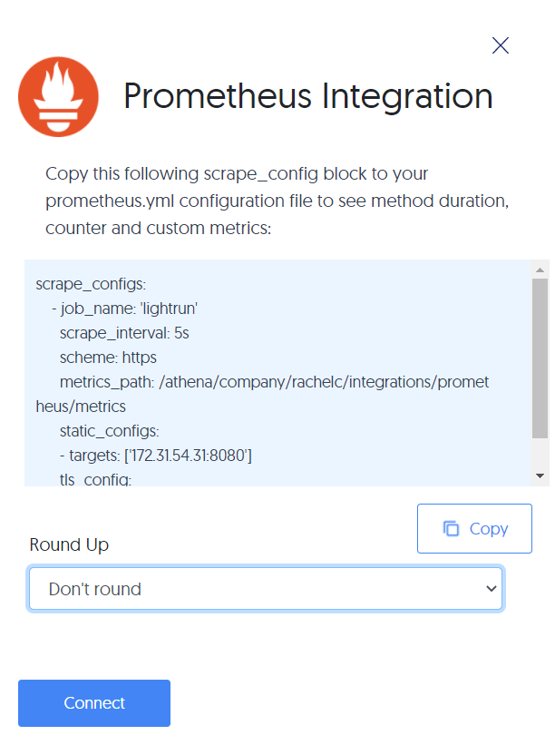
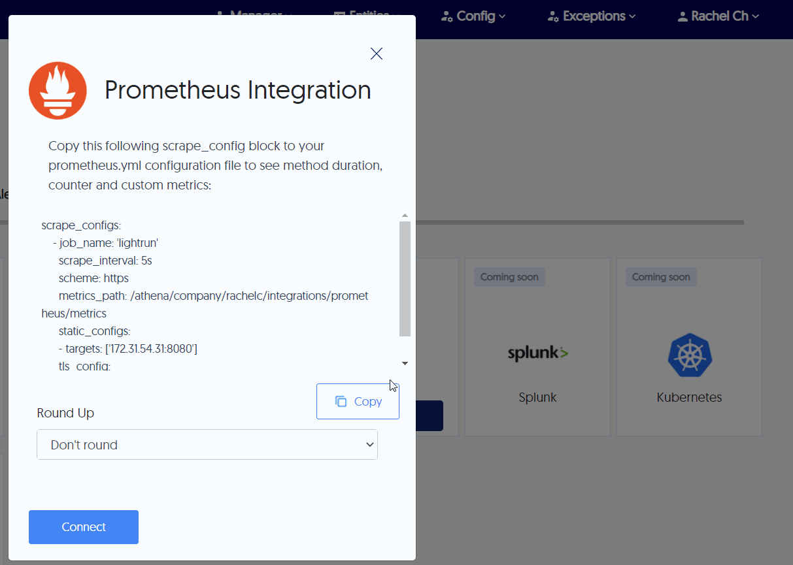

# Integrate the application server with Prometheus

Prometheus is an open source monitoring and alerting toolkit that scrapes and stores time series data from its configured targets (such as Lightrun), stores taht data locally and then runs rules over the data for aggregation, recording and alerting. and offers multiple modes for data visualization and alert configurations.

--8<-- "ux-reference/manager-role-only.md"

	 
!!! prerequisites
    Install and configure [Prometheus](https://prometheus.io/). Refer to the [Prometheus FAQ](https://prometheus.io/docs/introduction/faq/) as well for additional help.

    --8<-- "ux-reference/config-pipe.md"

## Connect to and disconnect from Prometheus

--8<-- "ux-reference/navigate-integrations.md"

2. From the **Integrations** page, click **Connect** from the Prometheus card.

    The **Prometheus Integration** window pops up:

    
	
3. Click **Copy** from under the scrape configuration. 

4. Paste the <code>scrape_configs</code> data to the existing <code>scrape_configs</code> section in your Prometheus YAML configuration file.

    

5. From the **Round Up** dropdown list, select the rounding rule to be applied by Prometheus for your Lightrun data.

6.  Click **Connect** and wait for the approval toast message.

7. To disable the configuration, click **Disconnect**.