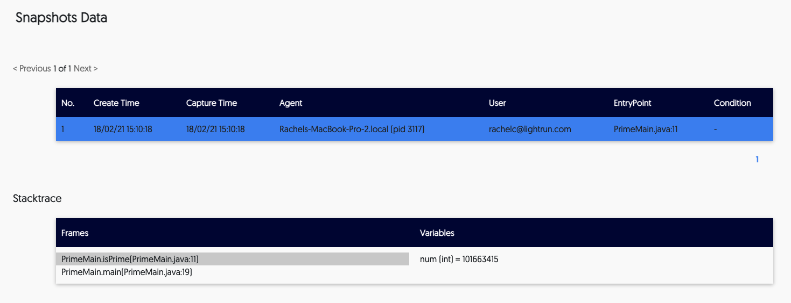

# Snapshot data
As your team works with Lightrun, they can dynamically insert snapshots to track information based on a variety of conditions. 

Once a snapshot is inserted into the application, the stacktrace can be viewed from the IDE and from the Lightrun app in your browser. 

##### To view snapshot data from the app

Log in to the app and navigate to **Entities->Snapshot Data**. 

The screen loads, and appears similar to the following: 
	

      
The screen is divided into two tables as follows: 
      

- A list of snapshots and their creation details appears at the top
- Stacktrace details

The following table describes the data available in the first table: 

| Column    | Description                                                  |
| --------- | ------------------------------------------------------------ |
| No   | The unique identifier assigned to the snapshot by the system    |
| Create time | The time at which the snapshot was created                        |
| Capture time     | The time at which the snapshot was actually taken. |
| Agent       | The agent or tag to which the snapshot was attached. |
| User       | The user who inserted the snapshot.  |
| Entry point       | The line of code at which the snapshot was inserted. |
| Condition       | If relevant, displays the condition that was used for the snapshot. |

Click the relevant snapshot from that table to view the associated stacktrace data in the second table. Following are the details available in this table (the Stacktrace table):

| Column    | Description                                                  |
| --------- | ------------------------------------------------------------ |
| Frame   | Each frame represents a single snapshot.    |
| Variables | Displays all related details for the selection in the Frame column.                        |

!!! note
    For more information about snapshots, see [Lightrun Actions](LightrunActions.md). 