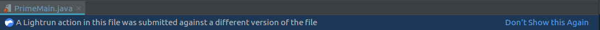

# Troubleshooting 

Sometimes issues may arise that interfere with smooth running. We've done our best to gather a list of come more common issues and possible solutions. If you can't find solutions here, contact us and we'll be happy to help. 

## Agents don't appear in IDE

If agents don't appear in the IDE, it could be because they are not running on the application server. If you're sure the agent is running, it could be due to connection or authentication issues from the client.

To resolve these, try:

-   Restarting the IDE

-   Logging in to Lightrun from the IDE again

If the agents still don't appear, contact your administrator for assistance.

## Lightrun actions in this file were submitted against a different version...​

This notification warning pops up when one or more actions in the open file were set against different source code. This might happen if you set an action after making edits to the file, or if an action was set to the same file by another person whose source code differs from yours.

This warning can be ignored, as it doesn't block the activation of the action. However, actions set on mismatching source code can cause unexpected behavior, so it is recommended to solve the issue.

To solve the issue, make sure that the application you are debugging is the same as the code in your editor (or the editor of whoever set the action). 

If the problem persists, you can disable the warning by clicking=>"Don't Show this Again" in the notification panel. Disabling this notification will also affect the way other people view the actions that you have set.

## Self-signed certificate is blocked {#_self_signed_certificate_is_blocked}

The troubleshooting may vary depending on browser, browser version or operating system. 

The following cover most of the popular browsers and operating systems:

*  [Getting Chrome to accept self-signed localhost certificate (per
    Chrome
    version)](https://stackoverflow.com/questions/7580508/getting-chrome-to-accept-self-signed-localhost-certificate)

*  [Ubuntu: Adding a self-signed certificate to the "trusted
    list"](https://unix.stackexchange.com/questions/90450/adding-a-self-signed-certificate-to-the-trusted-list)

*  [Creating and Trusting Self-Signed Certs on MacOS and
    Chrome/Safari](https://www.andrewconnell.com/blog/updated-creating-and-trusting-self-signed-certs-on-macos-and-chrome/)

*  [How to trust a self-signed SSL certificate in IE11 and
    Edge](https://medium.com/@ali.dev/how-to-trust-any-self-signed-ssl-certificate-in-ie11-and-edge-fa7b416cac68)

*  [How do you get Chrome to accept a self-signed certificate on
    Win10](https://www.pico.net/kb/how-do-you-get-chrome-to-accept-a-self-signed-certificate)

## Can't sign in from the plugin

Possible issues: 

* No connectivity to server (cloud)

* Check the Lightrun Server URL in the settings and make sure it's the same URL that appears in the browser page from which you're trying to authenticate

## Can't sign in from the browser

* No connectivity to server (cloud)

* Problem with embedded browser - try disabling Use Embedded Browser from Settings. 

## Agent exits immediately after starting the application

If you're running with classes (not jars), check that the class path has been configured.

Check that the Java path is correct for the agent. 

## Can't see logs in my IDE

* Check piping configuration to ensure it's set to Plugin or Both.

* Check all of the Lightrun Console filters to make sure you haven't filtered out the logs you're looking for

## Exceptions table is empty

Your application is perfect! But if you're convinced otherwise, try these options:

* Exception monitoring isn't enabled on the agent. (see agent properties)

* The manager might have cleared exception history. The next time an exception occurs it will appear here.

## Metrics not reported in external tools (system integrations)

* Double check the configurations for your webhook, app settings and the credentials you've used to integrate. 

* Check that additional integration settings are correct based on the third-party platform in order to ensure our server can send information to them. 

* Ensure piping is enabled. 

## Can't create a new action

* You're not logged in anymore. 

* You're not standing on a line of code, or you're standing on an empty line. 

* The agent is down. 

* There are currently no tags for any of the agents. 

* You're not connected to the correct source code version (the same version currently running with the agent)

* Your plugin might need to be upgraded to the newest version. 

## Can't delete an existing action

* You're not logged in anymore. 

* The agent isn't currently active. 

## Can't see Lightrun's sidebar

* The IntelliJ default is set to Collapse. 

* You've disabled or uninstalled the plugin or removed it from the sidebar.

* Check settings at View->Tool Windows->Lightrun)

## Can't configure Lightrun server settings

* You're not logged in anymore. 

* The server can't be accessed. 

## Can't switch user

* Log out of the currently active user first. 

* Clear cookies and try again. 

* If you're working from the browser, try a different browser and try incognito. 

