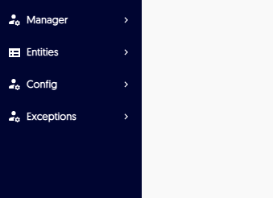

# Manage users and roles

!!! note
    Only Manager accounts have administrator permissions and can manage roles.

Administrators can manage users and their permissions as follows:

- [onboard new users and view pending invitations](#onboard)

- [manage users](#permissions)

## Onboard new users to Lightrun {#onboard}

In order to onboard new users to Lightrun, you need to invite them first. Once they join the organization's account, you can them give them the relevant permissions. 

1. Access Lightrun using your manager credentials. 

2. Navigate to the Manager menu and choose 

    
	
	The following window loads: 
	
	

3. You can invite a single or multiple users as follows: 

  - Invite a single user on the fly: copy the invitation link and send it to the user in a secure manner of your choice 
	
  - Invite a single or multiple users by mail: insert email addresses separated by commas and then click **Send**
	
  - [Create a single user](#to-edit-existing-users) from the management screen as described in the next section, and then send credentials to that user
	
4. View the list of invitations not yet accepted from the **Pending Invites** section. 

5. Once the user receives the invitation, by mail or on-the-fly, they click the link they receive and are re-directed to a registration page: 

	

6. The user should complete the registration information and click **Register**.

    Once the user registers, they can log in and access basic user screens.
	
	Additionally, they now appear in the **Users Management** list. 

			
	
	You can now further [refine their permissions](#to-edit-existing-users). 
	
## Add, edit and remove users and their permissions {#permissions}

Administrators can create, edit and remove users and their permissions.

As a manager (administrator), you can control the following permissions:

- Manager - additional capabilities enabling server and user management, such as creating and removing users, clearing exceptions and the like.

- Ignore quota - permissions to ignore the system quota; the quota controls use of CPU, Networking, Memory, excessively long strings, too many instructions printing out, protection from infinite loops and the like 

[//] # - Set value - permissions to insert actions with functions and other methods that might change values in the code

- User  - standard permissions to insert actions and view resulting data

###### To manage your users navigate to the User Management screen {#navigate}

1. Go to the **Manager** menu. 

2. Click **User management**. 

    The **User Management** screen loads:
	
			

###### To create a new user from the User Management screen  

1. [Navigate](#navigate) to the User Management screen. 

2. Click **Create new user**.
   
   The **Edit User** window pops up with empty fields.

3. Complete the fields with relevant details. 

	

4. To enable the user immediately, toggle the **Activated** button to green. 

5. Add [permissions](#permissions) from the **User Roles** window: click on the relevant role. To add multiple roles, press `CTRL`, and then click on the relevant roles.

###### To view user details

You can view the permissions and details that were entered for a user when created or modified, as well as the creation and modification details. 

1. [Navigate](#navigate) to the **User Management** screen. 

2. From the row for the relevant user click .

    The User details window pops up.  

###### To edit existing users 

1. [Navigate](#navigate) to the User Management screen. 

2. From the row for the relevant user click .

    The **Edit User** window pops up with empty fields.

3. Complete the fields with relevant details. 

	

4. To activate or deactivate the user, toggle the **Activated** button to green. 

5. Add or remove [permissions](#permissions) from the **User Roles** window: click on the relevant role to add or remove it. To add multiple roles, press `CTRL`, and then click on the relevant roles.

###### To remove a user 

1. [Navigate](#navigate) to the User Management screen. 

2. From the row for the relevant user, toggle the Active button to grey.

    The **Delete** icon now appears on the row.

3. Click .

    The **Confirm** window pops up:

	
	
4. When prompted, click **Delete** to remove the user.

