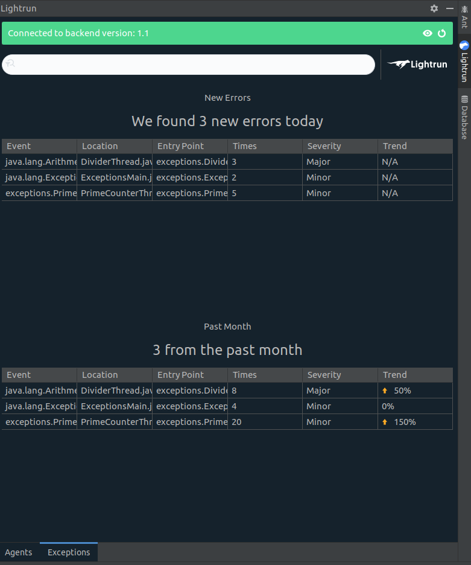

# View exceptions from IntelliJ

You can view exceptions that have been thrown over the last month, and for the current day, directly from your IDE. 

To view exceptions from IntelliJ click the **Exceptions** tab from the bottom of the Lightrun sidebar:

